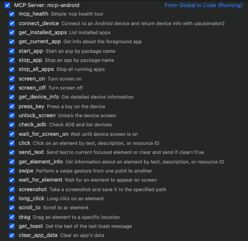
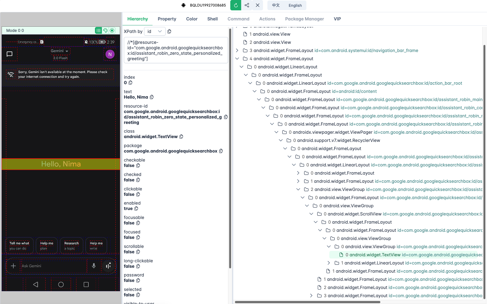

[](https://www.python.org/downloads/) [](https://github.com/nim444/mcp-android-server-python/actions/workflows/ci.yml) [](https://codecov.io/gh/nim444/sdet-django-api) [](https://github.com/astral-sh/ruff)
[](https://opensource.org/licenses/MIT)

# MCP Android Agent

This project provides an **MCP (Model Context Protocol)** server for automating Android devices using [uiautomator2](https://github.com/openatx/uiautomator2). It's designed to be easily plugged into AI agents like GitHub Copilot Chat, Claude, or Open Interpreter to control Android devices through natural language.

## Modular Architecture

The server has been refactored into a clean, modular architecture with tools organized by functionality:

```
mcp-android-server-python/
├── server.py                    # Main server (61 lines - clean & focused)
├── server_original_backup.py    # Backup of original monolithic version
└── tools/                       # 🆕 Modular tools package
    ├── __init__.py             # Central registration & imports
    ├── device_tools.py         # Device connection & status tools
    ├── app_tools.py            # Application management tools
    ├── screen_tools.py         # Screen control & unlock tools
    ├── input_tools.py          # User input simulation (click, swipe, text)
    ├── inspection_tools.py     # UI inspection & screenshots
    └── advanced_tools.py       # Advanced features (toast, activity wait)
```

### Benefits of Modular Architecture

- **Maintainability**: Easy to add/modify/remove tools without touching main server
- **Organization**: Tools grouped logically by functionality
- **Testing**: Individual tool modules can be unit tested separately
- **Reusability**: Tool modules can be reused in other projects
- **Scalability**: New tool categories can be added as separate modules
- **Clean Code**: Main server reduced from 1321 lines to 61 lines

## Quick Demo


----


## Requirements

- Python 3.13 or higher
- Android Debug Bridge (adb) installed and in PATH
- Connected Android device with USB debugging enabled
- [uiautomator2](https://github.com/openatx/uiautomator2) compatible Android device

## Features

### Device Management
- **Smart Device Detection**: Automatically finds and connects to available devices
- **Comprehensive Device Info**: Get serial, resolution, battery, WiFi IP, Android version
- **ADB Diagnostics**: Check ADB availability and connection status
- **Health Monitoring**: Built-in server health checks

### Application Management
- **App Discovery**: List all installed applications (system + user apps)
- **App Lifecycle Control**: Start, stop, force-stop apps by package name
- **App State Monitoring**: Track current foreground app and activity
- **Data Management**: Clear app data/cache for testing

### Screen & Display Control
- **Screen Power Management**: Turn screen on/off programmatically
- **Smart Unlock**: Automatic screen unlocking with standard methods
- **Screen State Monitoring**: Wait for screen activation (async support)

### User Input Simulation
- **Precision Interactions**: Click by text, resource ID, or content description
- **Advanced Gestures**: Long click, swipe, drag operations
- **Text Input**: Smart text entry with optional field clearing
- **Hardware Keys**: Simulate home, back, menu, volume keys

### UI Inspection & Debugging
- **Element Analysis**: Get detailed UI element properties and bounds
- **Screen Capture**: Take screenshots for debugging and documentation
- **UI Hierarchy**: Export complete screen structure as XML
- **Smart Waiting**: Wait for elements to appear with custom timeouts
- **Scroll Detection**: Auto-scroll to find elements in long lists

### Advanced Capabilities
- **Toast Detection**: Capture system toast messages for verification
- **Activity Monitoring**: Wait for specific Android activities
- **Background Operations**: Async support for time-consuming operations

## Use Cases

Perfect for:

- AI agents that need to interact with real devices
- Remote device control setups
- Automated QA tools
- Android bot frameworks
- UI testing and automation
- Device management and monitoring

## Installation

### 1. Clone the repo

```bash
git clone https://github.com/nim444/mcp-android.git
cd mcp-android
```

### 2. Create and activate virtual environment

```bash
# Using uv (https://github.com/astral-sh/uv)
uv venv
source .venv/bin/activate  # On Windows: .venv\\Scripts\\activate
```

### 3. Install dependencies

```bash
uv pip install
```

## Running the Server

### Option 1: Using uvicorn (Recommended)

```bash
uvicorn server:app --factory --host 0.0.0.0 --port 8000
```

### Option 2: Using MCP stdio (For AI agent integration)

```bash
python server.py
```

## Usage

An MCP client is needed to use this server. The Claude Desktop app is an example of an MCP client. To use this server with Claude Desktop:

### Locate your Claude Desktop configuration file

- Windows: `%APPDATA%\Claude\claude_desktop_config.json`
- macOS: `~/Library/Application Support/Claude/claude_desktop_config.json`

### Add the Android MCP server configuration to the mcpServers section

```json
{
  "mcpServers": {
    "mcp-android": {
      "type": "stdio",
      "command": "bash",
      "args": [
        "-c",
        "cd /path/to/mcp-adb && source .venv/bin/activate && python -m server"
      ]
    }
  }
}
```

Replace `/path/to/mcp-adb` with the absolute path to where you cloned this repository. For example: `/Users/username/Projects/mcp-adb`

### Using with VS Code

You can also use this MCP server with VS Code's agent mode (requires VS Code 1.99 or newer). To set up:

1. Create a `.vscode/mcp.json` file in your workspace:

```json
{
  "servers": {
    "mcp-android": {
      "type": "stdio",
      "command": "bash",
      "args": [
        "-c",
        "cd /path/to/mcp-adb && source .venv/bin/activate && python -m server"
      ]
    }
  }
}
```

Replace `/path/to/mcp-adb` with the absolute path to where you cloned this repository.

After adding the configuration, you can manage the server using:

- Command Palette → `MCP: List Servers` to view and manage configured servers
- Command Palette → `MCP: Start Server` to start the server
- The server's tools will be available in VS Code's agent mode chat



## UI Inspector

The project includes support for uiauto.dev, a powerful UI inspection tool for viewing and analyzing your device's interface structure.

1. Install the UI inspector:

```bash
uv pip install uiautodev
```

2. Start the inspector:

```bash
uiauto.dev
```

3. Open your browser and navigate to <https://uiauto.dev>



## Available MCP Tools

### Device Management Tools
| Tool Name | Description |
|-----------|-------------|
| `mcp_health` | Check if the MCP server is running properly |
| `get_device_status` | Get complete device status and readiness information |
| `connect_device` | Connect to an Android device and get basic info |
| `get_device_info` | Get detailed device info: serial, resolution, battery, etc. |
| `check_adb_and_list_devices` | Check if ADB is installed and list connected devices |

### Application Management Tools
| Tool Name | Description |
|-----------|-------------|
| `get_installed_apps` | List all installed apps with version and package info |
| `get_current_app` | Get info about the app currently in the foreground |
| `start_app` | Start an app by its package name |
| `stop_app` | Stop an app by its package name |
| `stop_all_apps` | Stop all currently running apps |
| `clear_app_data` | Clear user data/cache of a specified app |

### Screen Control Tools
| Tool Name | Description |
|-----------|-------------|
| `screen_on` | Turn on the screen |
| `screen_off` | Turn off the screen |
| `unlock_screen` | Unlock the screen (turn on and swipe if necessary) |
| `wait_for_screen_on` | Wait asynchronously until the screen is turned on |

### User Input Tools
| Tool Name | Description |
|-----------|-------------|
| `press_key` | Simulate hardware key press (e.g. `home`, `back`, `menu`, etc.) |
| `click` | Tap on an element by `text`, `resourceId`, or `description` |
| `long_click` | Perform a long click on an element |
| `send_text` | Input text into currently focused field (optionally clearing before) |
| `swipe` | Swipe from one coordinate to another |
| `drag` | Drag an element to a specific screen location |

### Inspection Tools
| Tool Name | Description |
|-----------|-------------|
| `get_element_info` | Get info on UI elements (text, bounds, clickable, etc.) |
| `wait_for_element` | Wait for an element to appear on screen |
| `scroll_to` | Scroll until a given element becomes visible |
| `screenshot` | Take and save a screenshot from the device |
| `dump_hierarchy` | Dump the UI hierarchy of the current screen as XML |

### Advanced Tools
| Tool Name | Description |
|-----------|-------------|
| `get_toast` | Get the last toast message shown on screen |
| `wait_activity` | Wait until a specific activity appears |

---

## License

This project is licensed under the MIT License - see the [LICENSE](LICENSE) file for details.
